# DIRAC, but mostly DiracX, for Workflow Management

 

**Federico Stagni** <Email v="federico.stagni@cern.ch" />

DiracGrid technical coordinator. CERN employee since 2009. Also part of LHCb.

 

14 May 2026
\_\_ <a href="https://indico.fnal.gov/event/73933" class="ns-c-iconlink"><mdi-open-in-new />Scientific Workflow Management Cross-Experiment Retreat at the LPC</a>

---
layout: section
color: cyan-light
title: Intro
---

# Intro

---
layout: top-title
color: gray-light
align: cm
title: DiracGrid
---

:: title::

# The DiracGrid project

:: content ::

Timeline:

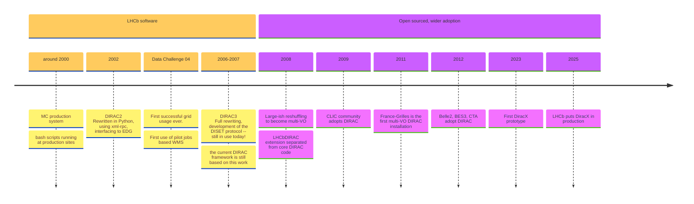

(full history in [this presentation](https://indico.cern.ch/event/1252369/contributions/5515343/attachments/))

Nowadays, the DiracGrid project develops/maintains DIRAC, DiracX, Web, etc... (everything in https://github.com/DIRACGrid).

[diracgrid.org](https://diracgrid.org) is hosting "everything" else you need.

---
layout: top-title-two-cols
color: gray-light
align: c-lm-lm
title: disambiguation
columns: is-4
---

:: title ::

# DIRAC and DiracX

:: left ::

 </img>

- An "interware" (a tool for doing distributed computing)
- Today is used **in production** by few dozens communities
- It can be used for managing jobs (via pilots), data, productions (workflows), dataset transfers, etc

:: right ::

 </img>

- "The neXt DIRAC incarnation", a complete rewrite aiming at fully replacing DIRAC. A cloud native app, multi-VO from the get-go, standards-based. [CHEP24 presentation](https://indico.cern.ch/event/1338689/contributions/6010971/).
  - Younger, faster, better, stronger.
- Used **in production** by LHCb, with few others getting there.
- Right now it can do few things, with the bulk of the operations still done by DIRAC.

<AdmonitionType type='important' >
Still DIRAC, in terms of functionalities.
</AdmonitionType>

---
layout: top-title-two-cols
color: gray-light
align: cm-cm-lm
title: who
---

:: title ::

# Users, and consortium

:: left ::

(A. Tsaregorotsev)

:: right ::

## Legally

The [**DIRAC Consortium**](https://diracgrid.org/consortium.html) was created in February 2014 to support development and promotion of the DIRAC software.

 

Dirac is on track to become an [HSF affiliated project](https://hepsoftwarefoundation.org/projects/affiliated.html).

---
layout: top-title
color: gray-light
align: c
title: core-functionalities
clicks: 5
---

:: title ::

## Core functionalities and tools (enormous simplification)

:: content ::

<v-switch>
<template #0>

### **Core functionalities**

 

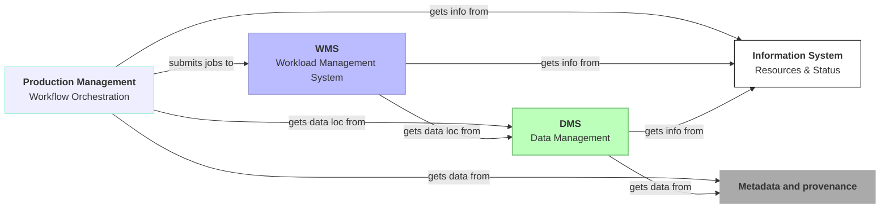
 
 

### **Tools** (subset of the existing ones)

 

</template>
<template #1>

# **JUNO**

 
 
 
 

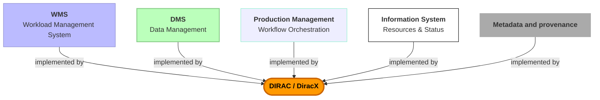

</template>
<template #2>

# **LHCb**

 
 
 
 

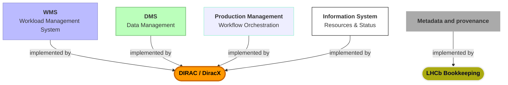

</template>
<template #3>

# **Belle2**, and **CTAO**

 
 
 
 

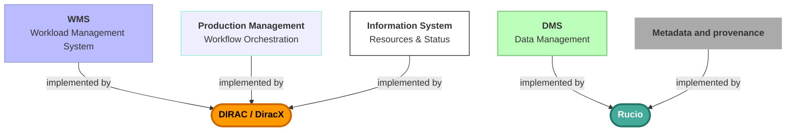

</template>
<template #4>

# **CMS**

 
 

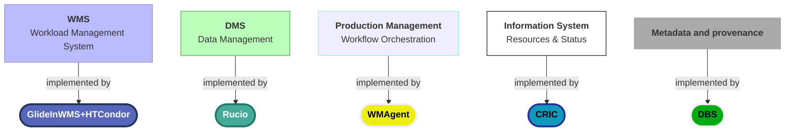

</template>
<template #5>

# **CMS**

 
 

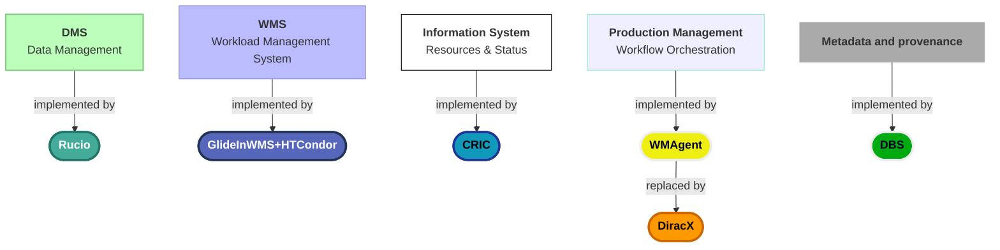

<SpeechBubble position="r" color='amber' shape="round"  v-drag="[200,320,400,120]">
I am here because CMS reviewed Dirac and has serious interests in using it as Workflow Management of choice for Run4.
</SpeechBubble>

</template>
</v-switch>

---
layout: top-title
color: gray-light
align: cm
title: whodoeswhat
---

:: title ::

# Users, VOs (communities), admins, developers, and coordinator(s)

:: content ::

- The end **users** are VOs users. Admins of the DIRAC/DiracX installations engage with them.
- A single DIRAC/DiracX installation can be used by several **VOs**.
  - EGI, GridPP, and other DIRAC installations are each used by a dozen VOs.
- Each installation has **admins** taking care of installations/updates etc. They are not necessarily the main operators of the installation (which are normally part of a VO).
- **Developers** are whoever care about developing and maintaining the system.
  - Members of LHCb, CTAO, GridPP, EGI, Belle2, FG, ILC all contributes or have contributed to it
  - LHCb maintains the highest concentration of core developers
- Current **coordinators** are Andrei Tsaregorodtsev (mostly non-technical) and Federico Stagni (technical). (re-)Elections happen 2 years.

---
layout: top-title
color: gray-light
align: cm
title: adminsflow
---

:: title ::

# Channeling Information

:: content ::

Apart from GitHub notifications, we use:

 

2 ML:
- For admins: diracproject-admins@cern.ch (1 or 2 admins per installation)
- For (power) users: diracproject-users@cern.ch 

 

We maintain a [team on CERN mattermost](https://mattermost.web.cern.ch/diracx/) with few mattermost channels, e.g.:
- For developments: https://mattermost.web.cern.ch/diracx/channels/developments-and-certifications
- For Rucio/Dirac: https://mattermost.web.cern.ch/diracx/channels/rucio---dirac 
- For "everything else", including most of the announcements: https://mattermost.web.cern.ch/diracx/channels/town-square

---
layout: top-title
color: gray-light
align: cm
title: devflow
---

:: title ::

# Developers' view: typical features' development flow

:: content ::

We use SCRUM.

1. The **Product Owner(s)** send a mail to diracproject-admins@cern.ch about topic X (anyone in the ML is effectively a product owner).
2. The technical coordinator collects/arranges the **user stories** which are written down in an "epic" issue on GitHub.
3. (Core) developers propose a **development plan** (on github), with follow-up on GitHub and/or in meetings.
4. **Tasks** are written. Coding starts. Anyone in the developers' pool can take up (or asked to take up) any of the tasks.
5. Follow-ups in [this board](https://github.com/orgs/DIRACGrid/projects/30/views/1), 2-weeks-long sprints.
6. System tests can be done on the [Dirac certification setup](https://github.com/DIRACGrid/DIRAC/wiki/Certifications).

---
layout: top-title
color: gray-light
align: cm
title: hackathons
---

:: title ::

# Getting together

:: content ::

### [**Meetings**](https://indico.cern.ch/category/20884/) (at CERN, and on Zoom):
- every Thursday morning, 10:00 CERN time, a "Ddev" meeting of 1 hour takes place
  - Hosted by the SCRUM master (Alexandre Boyer).
- every 4 to 5 weeks, a "Dops" meeting of 1 hour takes place just before the Ddev.
  - Hosted by the technical coordinator. A more high-level view meeting, targeted at admins.

### [**Hackathons and Workshops**](https://indico.cern.ch/category/20884/)

- We organize **4 hackathons per year**. 2 days, and normally: 3 of them are at CERN, 1 during the workshop.
  - Next hackathon: 1-2 July, at CERN -- https://indico.cern.ch/event/1668629/
- Next **workshop**: 13-16 October, FZU, Prague -- https://indico.cern.ch/e/duw12 
  - registrations are open!

---
layout: top-title
color: gray-light
align: cm
title: question
clicks: 1
---

:: title ::

# The question, for this WS

:: content ::

<v-switch>
<template #0>

DiracX Workflow Orchestration: what, and how?

</template>
<template #1>

DiracX Workflow Orchestration: what, and how?

and when?

</template>
</v-switch>

---
layout: section
color: cyan-light
title: Dirac(X) and Workflows
---

# Dirac(X) and Workflows
## (the "Production System")

---
layout: top-title
color: gray-light
align: cm
title: Concepts
---

:: title ::

# DIRAC Concepts

:: content ::

| **Dirac Name** | **AKA** | **Description** | **Example** |
|------------|----------------|-------------|---------|
| Production Request | Workflow | A full fledged processing, with several definitions of payloads | DataReconstruction |
| Transformation | Work Queue Unit | A unit of the production request, each might run more then 1 payload definition | Merge |
| Transformation Inputs | Rucio Container | The list of LFNs in input to a transformation | `[lfn_1, lfn_2, ... , lfn_534]` |
| Transformation Plugin | ? | The policy for creating tasks | ByRun |
| Task | | A proto-job, pushed to the WMS | Type:`Merging`,Inputs:`[lfn_1, lfn_2]`,Payload_id:`123` | 

---
layout: top-title
color: gray-light
align: cm
title: PMS
---

:: title ::

## DIRAC Production Requests

container of steps

:: content ::

With a *step* being the description of a payload (which application, version, options, ...)

 
 

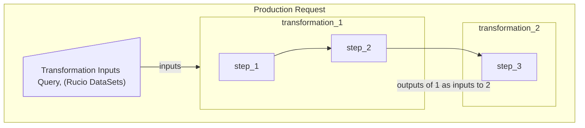

---
layout: top-title
color: gray-light
align: cm
title: WFS
---

:: title ::

# Putting everything together

:: content ::

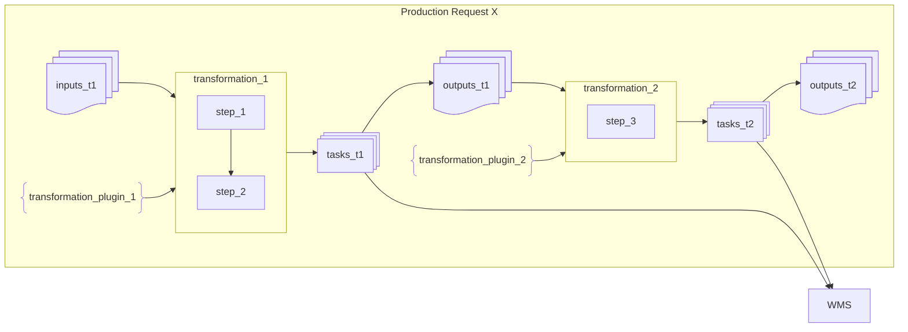

- DIRAC's transformations can be chained one to the other
- The DIRAC production system links them together
- DiracX "Production System" will be an evolution of the DIRAC's one

---
layout: top-title
color: gray-light
align: cm
title: WFS-VO
---

:: title ::

# The VO's policies 

:: content ::

A very important concept of DIRAC is its extensibility. Its primary goal is to accommodate VO specificities.

There are VO specific policies.
VO specific policies descend for VO specific concepts, e.g. a physics "fill", or "run", or "portion of the sky". They *should* live in a VO extension.

Examples:
- Pretty much everything through which you describe your data, and that you want to use for creating tasks through transformation plugins
- Workflow modules (you want your jobs to run something specific before, during or after the payloads)
- Access to specific services or databases

---
layout: section
color: lime-light
---

    
    -->
    

---
layout: top-title
color: gray-light
align: c
title: points
---

:: title ::

# Notable points

:: content ::

DiracX is developed on a daily base.

So is DIRAC, but for DIRAC we do only fixes, and minor features. 

 
 

<AdmonitionType type='note' >
There are several communities using DIRAC right now. Their business continuity is our top priority.
</AdmonitionType>

<AdmonitionType type='important' >
DIRAC and DiracX will live together for a while
</AdmonitionType>

<AdmonitionType type='info' >
One functionality at a time, we'll eventually migrate all from DIRAC to DiracX.
</AdmonitionType>

<SpeechBubble position="t" color='cyan' shape="round"  v-drag="[300,415,550,60]">
The priorities for the developments are discussed collectively
</SpeechBubble>

---
layout: top-title
align: c
color: gray-light
title: DiracX tech
---

:: title ::

# Technicalities of DiracX

:: content :: 

<ul class="text-sm">
  <li>DiracX is written in python 3</li>
  <li>REST APIs <a href="https://diracx.diracgrid.org/en/latest/dev/explanations/components/routes/" class="ns-c-iconlink"><mdi-open-in-new />developed with FastAPI</a></li>
  <li>DiracX <a href="https://diracx.diracgrid.org/en/latest/admin/explanations/tasks/" class="ns-c-iconlink"><mdi-open-in-new />tasks</a> use Redis as backend</li>
  <li><a href="https://diracx.diracgrid.org/en/latest/admin/how-to/install/installing/" class="ns-c-iconlink"><mdi-open-in-new />Deployment</a> via Kubernetes (charts provided) or with containers</li>
  <li>The <a href="https://diracx.diracgrid.org/en/latest/dev/explanations/web-architecture/" class="ns-c-iconlink"><mdi-open-in-new />Web App is implemented in TypeScript, and React</a>. At the moment using NextJS, planning to move to Vite</li> 
  <li>The transaction databases (MySQL and OpenSearch) are shared with DIRAC</li>
  <li>For its <a href="https://diracx.diracgrid.org/en/latest/admin/explanations/auth-with-diracx/" class="ns-c-iconlink"><mdi-open-in-new />internal AuthN/Z</a>, JWT tokens are used
    <ul class="text-xs">
      <li>you will of course need to be registered in an IdP if you want to access the Grid, but DiracX has its own tokens. Link to <a href="https://diracx.diracgrid.org/en/latest/admin/reference/security_model/" class="ns-c-iconlink"><mdi-open-in-new />Security model</a></li>
    </ul>
  </li>
</ul>

---
layout: top-title-two-cols
color: gray-light
align: c-lm-lm
title: chart
---

:: title :: 

# DiracX: the Helm Chart <devicon-helm class="text-3xl align-middle inline-block mx-0"></devicon-helm>

:: left ::

The first thing an admin have to look at is the provided [Helm chart](https://github.com/DIRACGrid/diracx-charts), for which there is a [Unique pointer](https://charts.diracgrid.org/index.yaml)

<ul class="text-sm">
  <li>Effectively the chart is used also for:
    <ul>
      <li>DiracX testing (GitHub actions)</li>
      <li>Local development</li>
      <li>Running a demo instance</li>
      <li>Running test and productions instances</li>
    </ul>
  </li>
</ul>

DiracX can also be deployed simply with with containers. Its documentation is right now in a PR.

:: right ::

<AdmonitionType type="info" width="300px">
The helm charts provide everything, including MySQL and Opensearch, and iam. 
This is intended for local development, not for production.
</AdmonitionType>

<AdmonitionType type="important" width="300px">
As admin, you will need to create *your* helm chart with what you want to run in production
</AdmonitionType>

CTAO has [developed a HELM chart with both DIRAC and DiracX in it](http://cta-computing.gitlab-pages.cta-observatory.org/dpps/dpps/latest/developer-guide.html)

---
layout: side-title
color: gray-light
title: Externals
align: cm-lm
titlewidth: is-2
---

:: title ::

# DiracX: necessary tools

:: content ::

As of today, you can't run DiracX without these services:
<ul class="text-sm">
  <li>MySQL (or MariaDB) (needed for DIRAC)</li>
  <li>OpenSearch (with a request for re-support ElasticSearch) (needed for DIRAC)</li>
  <li>S3-compatible object store for storing the Job Sandboxes (no need for the Workflow Orchestration) </li>
  <li>RECOMMENDED: Kubernetes for running DiracX services and tasks</li>
  <li>a Grafana instance (not immediately, but will be needed)</li>
  <li>OpenTelemetry (not immediately, but maybe you will want to have it)</li>
</ul>

 

---
layout: top-title
color: gray-light
align: c
title: FAQ
---

:: title ::

# Status of DIRAC to DiracX migration 

:: content ::

 
- Nowadays, what's DiracX used for?

DiracX currently handles few notable tasks for which scalability was a concern in DIRAC.

 
- Can I use DiracX without DIRAC?

ATM, no, simply because DiracX has few features at the moment, and those are there to work together with DIRAC. 
DiracX can "start", its REST APIs would be responding to queries, all underpinnings ready...

 
- When will it work without DIRAC?

...It depends! from what you want it to do.

 
- What about the DiracX Productions (the "Workflow Orchestration" system)?

In development. And yes, this in an opportunity!

---
layout: top-title
align: c
color: gray-light
title: DiracXTS 
---

:: title ::

# DiracX production system (workflow system)

:: content :: 

In general, there are still several things to decide. I believe that, at a minimum:
- the current DIRAC Transformation System will serve as base.
- Several of the goodies from LHCb DIRAC Analysis Productions system will be integrated in the DiracX Production (Workflows) system.
  - you hears about them yesterday in Ryunosuke's presentation
- We will use CWL for describing production requests and transformations.

 
 

This is a good time to inject (your!) requirements.

---
layout: top-title
color: gray-light
align: cm 
title: DiracXWMS
---

:: title ::

# CWL for DiracX

:: content ::

  
  
  

We have been recently tested the first [CWL jobs](https://github.com/DIRACGrid/diracx/issues/858). Next, we will look into describing `Transformation` and `Production` through CWL hints.

<SpeechBubble position="t" color='light-red' shape="round"  v-drag="[400,440,480,90]">
  Main involvements: LHCb, CTAO. CMS should likely get involved here ASAP (now, effectively).
</SpeechBubble>

---
layout: iframe-right
title: extesion
url: https://diracx.diracgrid.org/en/latest/dev/explanations/extensions/
class: webAPI
slide_info: false
color: gray-light
align: lm
---

# DiracX extensions

A very important concept also for DiracX is its extensibility. Full documentation on the left (pointing [here](https://diracx.diracgrid.org/en/latest/dev/explanations/extensions/))!

We provide a reference implementation of an extension (dubbed "Gubbins").

---
layout: iframe-right
title: multi-VO
url: https://diracx.diracgrid.org/en/latest/admin/how-to/install/register-a-vo/
class: webAPI
slide_info: false
color: gray-light
align: lm
---

# Multi-VO DiracX

DIRAC is often operated as a multi-VO instance. This is the case for most of the VOs using DIRAC (you have seen this is the case also for FCC).

Especially useful for small-to-medium size VOs, which usually just need basic functionalities ("I just want to submit jobs"). Often these installations do not provide production system functionalities.

DiracX is multi-VO from the get-go.
(the frame on the right is [pointing to](https://diracx.diracgrid.org/en/latest/admin/how-to/install/register-a-vo/) related DiracX documentation)

---
layout: top-title-two-cols
align: cm-cm-lm
color: orange-light
columns: is-3
title: summary
--- 
:: title ::

# Summary

:: left :: 

:: right ::

In general, DIRAC has a very active community of users and developers.

- DiracX is "the neXt Dirac incarnation", ensuring the future of the widely used DIRAC.
  - It will live together with DIRAC v9 for a while, until it will replace it completely
  - It's developed by a superset of the current DIRAC developers
- DiracX production system is "not yet there", but DIRAC's one is. We (think we) know how to make it
  - All DiracX users are invited to participate to it

---
layout: credits
color: navy
loop: true
speed: 1.0
title: credits/people
---

    

        <strong>People</strong> 
    

    

        <strong>Current Developers, maintainers, supporters (non-exhaustive list)</strong>
    

    

        Chris Burr <i>CERN, LHCb</i> 
        Christophe Haen <i>CERN, LHCb</i> 
        Alexandre Boyer <i>CERN, LHCb</i> 
        Natthan Piggoux <i>LUPM (FR), CTAO</i> 
        Cedric Serfon <i>Brookhaven National Laboratory (US), Belle2</i> 
        Ryunosuke O'Neil <i>CERN, LHCb</i> 
        Daniela Bauer <i>Imperial collegOe (UK), GridPP</i> 
        Simon Fayer <i>Imperial college (UK), GridPP</i> 
        Janusz Martyniak <i>Imperial college (UK), GridPP</i> 
        Xiaomei Zhang <i>Beijing, Inst. High Energy Phys. (CN), Juno</i> 
        Luisa Arrabito <i>LUPM (FR), CTAO</i> 
        André Sailer <i>CERN, ILC</i> 
        Jorge Lisa Laborda <i>Univ. of Valencia and CSIC (ES), LHCb</i> 
        Bertrand Rigaud <i>IN2P3 (FR), France-Grilles</i> 
        Heloise Joffe <i>IN2P3 (FR), France-Grilles</i> 
        Stella Maria Renucci <i>LUPM (FR), CTAO</i> 
        Mazen Ezzeddine <i>CPPM (FR), EGI</i> 
        Loris vankatwijk <i>LUPM (FR), CTAO</i>
    

    

        <strong>Project lead</strong>
    

    

        Federico Stagni <i>CERN, LHCb</i> 
        Andrei Tsaregorotsev <i>CPPM (FR), EGI, LHCb, Juno</i>
    

&nbsp;
&nbsp;
&nbsp;
&nbsp;
&nbsp;

    <strong>Questions?</strong>

---
layout: section
color: cyan-light
title: Backup
---

# Backup

---
layout: top-title-two-cols
color: gray-light
align: c-lm-lm
title: dirac
columns: is-5
---

:: title ::

# DiracX and heterogeneous slots

:: left ::

- Nowadays *Dirac(X) can take a node consisting of several CPUs and partition it*. CPUs only.
- The **match-making** process (the process of matching job needs to job slots capabilities) can use a very simple system for tagging slots including GPUs. This is not fully applicable for heterogeneous nodes.

:: right ::

Would not be able to fully exploit nodes like this:

  

  

    Source: https://docs.lumi-supercomputer.eu/hardware/lumig/
  

---
layout: top-title-two-cols
color: gray-light
align: c-lm-lm
title: diracx
columns: is-5
---

:: title ::

# DiracX and heterogeneous slots (cont)

:: left :: 

In the context of DiracX, LHCb is working on:

- Using CWL for jobs and workflow description

:: right ::

- A realistic **slot description for heterogeneous architectures**
- An advanced jobs match-making
- "Solving" the general case of **whole node scheduling**: whole-node scheduling and benchmarking seem to be the best way forward.

---
layout: side-title
align: lm-lm
color: gray-light
title: WMS
titlewidth: is-3
---

:: title ::

## Workload Management System
- Pull model based on Pilot jobs
- Also "Push" solution for HPCs that do not support pilots (because of limited internet access).
- Will integrate [CWL (Common Workflow Language)](https://www.commonwl.org) as a way of defining jobs (replacing JDL)

:: content ::

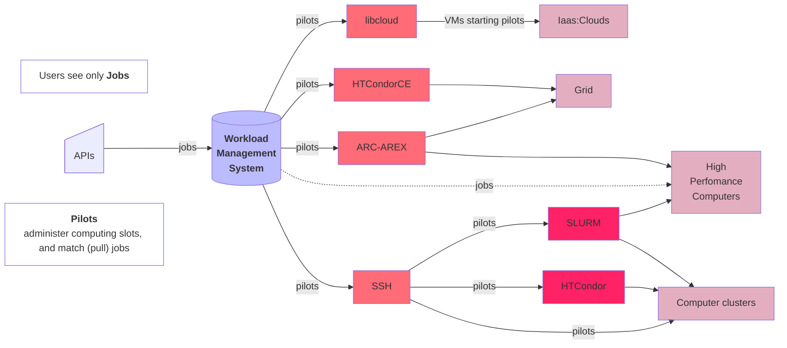

---
layout: side-title
align: lm-lm
color: gray-light
titlell: DMS
titlewidth: is-5
---

:: title ::

## Data Management System
It’s about **files**:​ placing, replicating, removing files​

- there are **LFNs** (logical file names)
- **LFNs** are registered in *catalog(s)​*
    - where are the LFNs? (in the DIRAC File Catalog (DFC), or in Rucio)​
    - where are their metadata? (in the DFC, or in the LHCb Bookkeeping, or in AMGA)​
- LFNs *may* have **PFNs** (physical file names), stored in **SEs** (Storage Elements), that can be accessed with several protocols.​

:: content ::

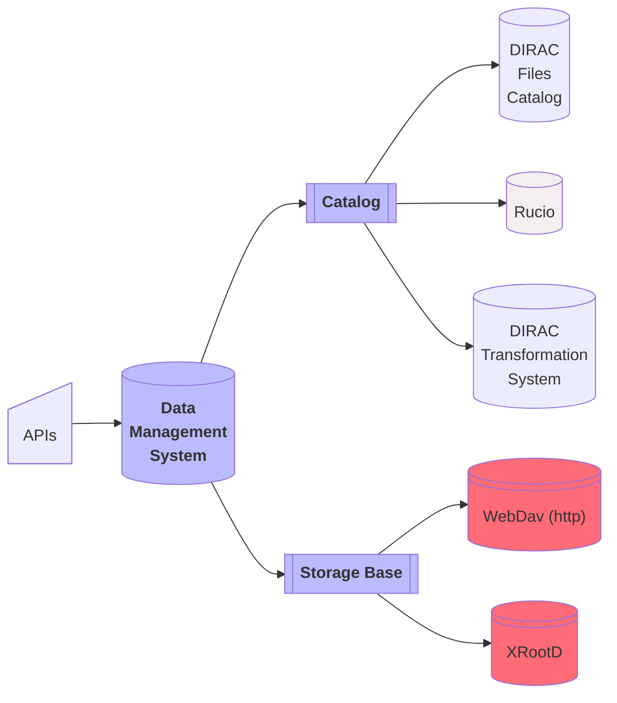

<!-- 
A catalog is effectively an interface, that needs implementation. Such implementation can be the DIRAC Files Catalog, or Rucio, or any other, including extension specific ones
-->

---
layout: top-title
color: gray-light
align: c
title: integration
---

:: title ::

# How DIRAC and Rucio work together

:: content ::

The entry point is the DIRAC's `RucioFileCatalog`, which is an implementation of the `FileCatalog` "abstract" class (DIRAC has few different implementation of the same class, and you can `register_file()` to more than 1 catalog at the same time)
- in DIRAC since 2021
- by now it supports *Multi VO* and *Rucio metadata*
- The synchronization between DIRAC and Rucio is done via DIRAC
agents

Once the data is in the Rucio catalog, all the replication policies, 3rd party copy are handled by Rucio subscriptions and rules. 

This also means that:
- Admins still updates the DIRAC configuration
- No change for the download/upload from jobs: still done via the DIRAC's `DataManager`

---
layout: top-title
color: gray-light
align: c
title: namespace
---

:: title ::

# How DIRAC and Rucio work together -- namespace

:: content ::

- By default, Rucio has a flat namespace that contains files
  - Files that can be aggregated to datasets
  - Then datasets can be aggregated to container
- DIRAC uses a hierarchical namespace

The `RucioFileCatalog` "translates" from DIRAC to Rucio's namespace. All details in [this vCHEP presentation](https://indico.cern.ch/event/948465/contributions/4323983/attachments/2247115/3811355/The%20Rucio%20File%20Catalog%20in%20Dirac%20implemented%20for%20Belle%20II-2.pdf)

